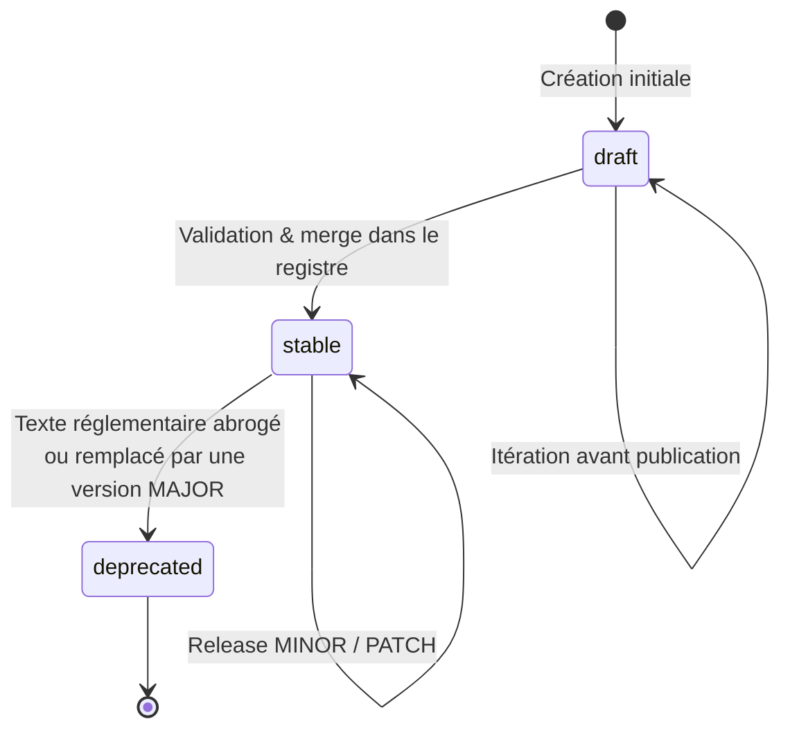

# Concept — Cycle de vie d'un algorithme réglementaire

Un algorithme réglementaire traverse plusieurs états au fil du temps, indépendamment de son cycle de vie logiciel.

---

## États du cycle de vie



| État | Signification | `regalgo:status` |
|---|---|---|
| `draft` | En cours de développement, non validé | `"draft"` |
| `stable` | Validé, dans le registre public | `"stable"` |
| `deprecated` | Remplacé ou abrogé — maintenu pour compatibilité | `"deprecated"` |

---

## Cycle de vie normative vs logicielle

Un algorithme peut être stable *techniquement* mais devoir évoluer pour des raisons *réglementaires* :

| Déclencheur | Impact logiciel | Impact `metadata.json` |
|---|---|---|
| Correction de bug de calcul | PATCH (`1.0.0` → `1.0.1`) | `regalgo:changelog` |
| Nouvelle option paramétrique | MINOR (`1.0.0` → `1.1.0`) | `cpsv:hasInput` mis à jour |
| Nouveau texte réglementaire | MAJOR (`1.0.0` → `2.0.0`) | `cv:hasLegalResource` mis à jour |
| Texte abrogé sans successeur | Dépréciation | `regalgo:status: deprecated` |
| Texte remplacé par un autre | MAJOR + `dct:replaces` | Nouveau package recommandé |

---

## Gestion de la dépréciation

Quand un algorithme est déprécié :

1. Mettre `regalgo:status` à `"deprecated"` dans `metadata.json`
2. Ajouter `dct:replaces` dans le nouvel algorithme
3. Ne **pas** supprimer le package PyPI (les utilisateurs existants doivent pouvoir reproduire les calculs passés)
4. Émettre un `DeprecationWarning` Python dans `compute()` :

```python
import warnings

def compute(self, algo_input: AlgoInput) -> AlgoResult:
    warnings.warn(
        f"{self.algo_id} est déprécié. "
        f"Migrer vers civique.droit-vote.v2 (regalgo-civique-droit-vote>=2.0).",
        DeprecationWarning,
        stacklevel=2
    )
    # ... calcul inchangé
```

---

## Voir aussi

- [Guide : Versionner selon CalVer/SemVer réglementaire](../how-to-guides/versioning.md)
- [Schéma de métadonnées — champs `dct:replaces`, `regalgo:status`](../reference/metadata-schema.md)
