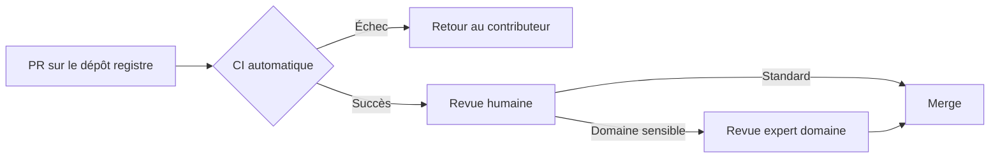

# Concept — Modèle de gouvernance

---

## Qui peut publier ?

Le registre est **ouvert** : toute organisation (administration, éditeur, association) peut soumettre un algorithme, sous réserve que :

1. Le package respecte le standard (`regalgo-validator check` passe)
2. L'algorithme est réellement réglementaire (encadré par un texte de loi ou règlement)
3. Le `cv:hasLegalResource` pointe vers une ressource vérifiable (EUR-Lex, Légifrance, JORF)

---

## Processus de revue

**Délais cibles :**

- CI : < 5 minutes
- Revue humaine : < 3 jours ouvrés
- Revue expert (si déclenchée) : < 10 jours ouvrés

---

## Mainteneurs du registre

Le registre est maintenu par un collectif interadministratif. Les mainteneurs sont issus de :

- DINUM (Direction interministérielle du numérique)
- Autorités sectorielles (EBA, AMF, HAS selon les domaines)
- Contributeurs open source reconnus

---

## Règles de dépréciation

Un algorithme ne peut être déprécié que si :

- Le texte réglementaire de référence est abrogé ou remplacé, **ou**
- Un algorithme successeur (`dct:replaces`) est disponible et stable dans le registre

Un algorithme déprécié reste **indexé et installable** pour garantir la reproductibilité des calculs historiques.

---

## Licences acceptées

Seules les licences open source approuvées par l'OSI sont acceptées. Licences recommandées :

| Licence | Usages |
|---|---|
| MIT | Usage général, maximise la réutilisation |
| Apache 2.0 | Si brevets logiciels à couvrir |
| EUPL 1.2 | Licence européenne, compatible GPL |
| LGPL 3.0 | Si réutilisation en contexte propriétaire requise |

Les licences propriétaires, les licences "non-commercial" ou "research only" sont **refusées**.
