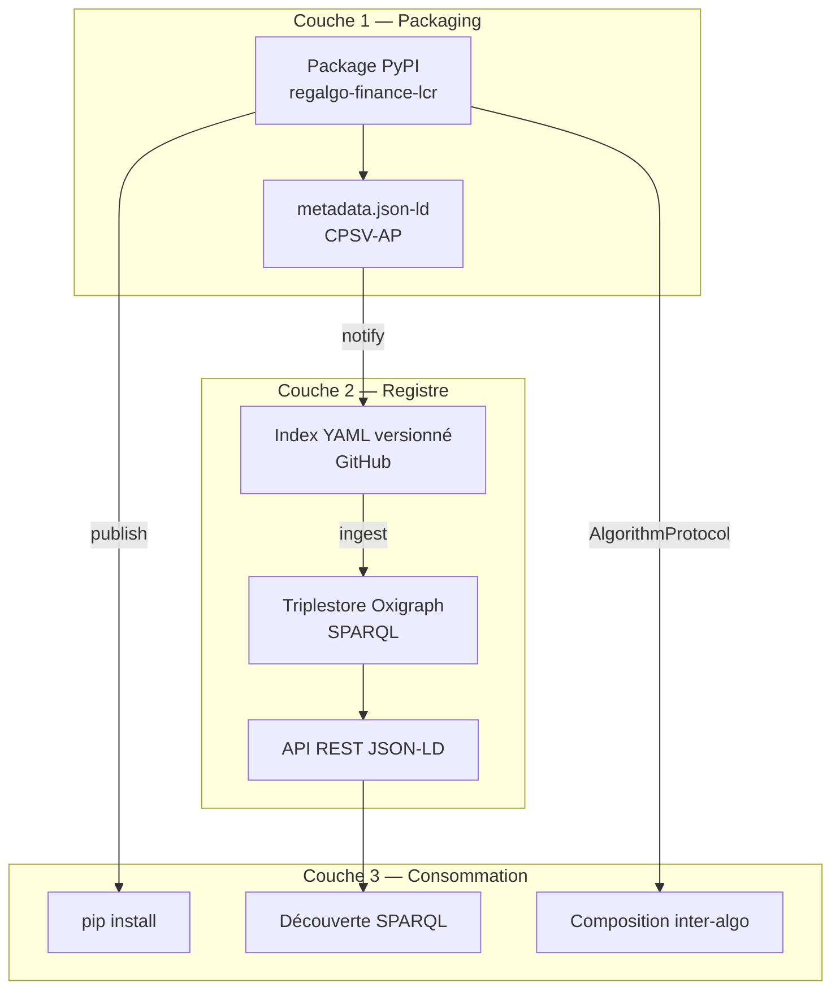

# Concept — Architecture du registre

Cette page explique les **choix architecturaux** du registre : pourquoi ces décisions ont été prises, quelles alternatives ont été écartées, et comment les différentes couches s'articulent.

---

## Vue d'ensemble

Le registre est composé de trois couches indépendantes mais interopérables :



---

## Couche 1 : PyPI comme source de vérité

**Décision :** Le package PyPI *est* l'algorithme. Il n'y a pas de dépôt central de code — chaque organisation maintient son propre package.

**Pourquoi :**

- PyPI est une infrastructure de confiance, maintenue, avec CDN mondial
- La traçabilité est assurée par le versioning immuable de PyPI (un wheel publié ne peut pas être modifié)
- `pip install` est l'interface universelle des développeurs Python
- Pas de lock-in sur une plateforme de dépôt de code particulière

**Conséquence :** Le fichier `metadata.json` embarqué dans le wheel est la source de vérité sémantique. L'index du registre n'est qu'un **reflet** de ces métadonnées.

---

## Couche 2 : Index Git + Triplestore

### L'index YAML comme journal d'entrées

Le registre public est un dépôt Git contenant un fichier `registry/index.yaml`. Chaque entrée est validée par CI avant merge.

**Avantages :**

- Traçabilité complète via l'historique Git
- Processus de revue via Pull Requests
- Pas d'infrastructure serveur pour les écritures
- Tout le monde peut vérifier l'index

### Oxigraph pour les requêtes sémantiques

À chaque merge sur `main`, un job CI ingère le `metadata.json` de chaque package dans un triplestore **Oxigraph** (compatible SPARQL 1.1).

**Pourquoi Oxigraph :**

- Natif Rust, performant, déployable comme service léger
- Support SPARQL 1.1 complet
- Conforme aux standards W3C RDF
- Documenté dans le [vocabulaire commun DINUM](https://qloridant.github.io/vocabulaire-commun/guides/04-oxigraph-deploiement/)

---

## Couche 3 : Interopérabilité par `AlgorithmProtocol`

L'interopérabilité Python est assurée par un **`typing.Protocol`** plutôt que par héritage ou ABCs.

**Pourquoi Protocol et non ABC :**

| Critère | `typing.Protocol` | `ABC` |
|---|---|---|
| Couplage | Zéro — duck typing | Fort — héritage obligatoire |
| Compatibilité | Tout objet conforme | Doit hériter de la classe |
| Vérification statique | ✅ mypy/pyright | ✅ mypy/pyright |
| Vérification runtime | ✅ `isinstance()` avec `@runtime_checkable` | ✅ `isinstance()` |
| Migration | Un algo existant peut être adapté sans modification | Doit modifier la hiérarchie |

**Conséquence :** Un algorithme écrit avant la création du registre peut rejoindre le registre en ajoutant uniquement `metadata.json` et en vérifiant que ses méthodes respectent le contrat — sans toucher à son code.

---

## Pourquoi JSON-LD et pas JSON pur ?

Le fichier `metadata.json` est du **JSON-LD** (JSON for Linked Data), pas du JSON propriétaire.

**Ce que ça change :**

```json
// JSON propriétaire — sémantique opaque
{"regulation": "CRR2", "article": "412"}

// JSON-LD — sémantique explicite et liée
{
  "cv:hasLegalResource": {
    "@type": "cv:LegalResource",
    "owl:sameAs": {"@id": "http://data.europa.eu/eli/reg/2013/575/oj"}
  }
}
```

Avec JSON-LD, n'importe quel moteur de raisonnement RDF peut :

- Déduire que deux algorithmes référencent le même texte de loi
- Aligner automatiquement avec EUR-Lex, Wikidata, EU Vocabularies
- Répondre à des requêtes SPARQL transversales

---

## Relation avec CPSV-AP

Le choix de modéliser les algorithmes comme des `cpsv:PublicService` n'est pas anodin :

- Un algorithme réglementaire *est* un service public numérique : il prend des entrées (`cv:Evidence`), applique une règle (`cv:LegalResource`), produit un résultat (`cpsv:Output`), sous l'autorité d'un organisme (`cv:PublicOrganisation`)
- CPSV-AP est le standard européen adopté pour décrire les services publics numériques (programme ISA²/SEMIC)
- Cela permet une interopérabilité native avec les catalogues européens (data.europa.eu, service-public.fr)

---

## Voir aussi

- [Pourquoi l'interopérabilité réglementaire](why-interoperability.md)
- [Cycle de vie d'un algorithme](algo-lifecycle.md)
- [Modèle de gouvernance](governance.md)
- [Déployer Oxigraph — vocabulaire commun DINUM](https://qloridant.github.io/vocabulaire-commun/guides/04-oxigraph-deploiement/)
