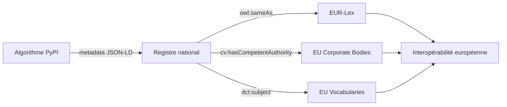

# Concept — Pourquoi l'interopérabilité réglementaire

## Le problème des silos algorithmiques

Les administrations et les acteurs régulés produisent aujourd'hui des algorithmes réglementaires dans un éclatement complet :

| Symptôme | Conséquence |
|---|---|
| Chaque organisation réimplémente le même calcul | Divergences silencieuses, risque de non-conformité |
| Aucune traçabilité de la version normative | Impossible de savoir quelle version d'un texte est appliquée |
| Formats d'entrée/sortie incompatibles | Impossible de chaîner les calculs entre organisations |
| Pas d'index public | Découverte par bouche-à-oreille ou réimplémentation |

---

## Ce que résout le registre

Le registre applique aux algorithmes réglementaires le même raisonnement que le **Web sémantique** applique aux données :

> *"Le problème n'est pas le manque de données, c'est le manque de données dont la sémantique est partagée et formalisée."*

De la même façon :

> *"Le problème n'est pas le manque d'algorithmes réglementaires, c'est le manque d'algorithmes dont le contrat d'interface et la référence normative sont formalisés."*

---

## L'alignement EU Vocabularies comme levier

En exprimant les métadonnées dans les **Core Vocabularies SEMIC**, le registre bénéficie gratuitement de l'alignement avec :

- **EUR-Lex** via `eli:id_local` et `owl:sameAs` → les textes réglementaires sont liés à leur version officielle
- **EU Corporate Body Authority** via `cv:PublicOrganisation` → les autorités sont standardisées (EBA, AMF…)
- **NUTS/GeoNames** pour les algorithmes à portée territoriale
- **DCAT-AP** pour la publication dans les catalogues open data

---

## Voir aussi

- [Architecture du registre](registry-architecture.md)
- [Vocabulaire commun DINUM](https://qloridant.github.io/vocabulaire-commun/)
- [SEMIC — Semantic Interoperability Community](https://joinup.ec.europa.eu/collection/semantic-interoperability-community-semic)
