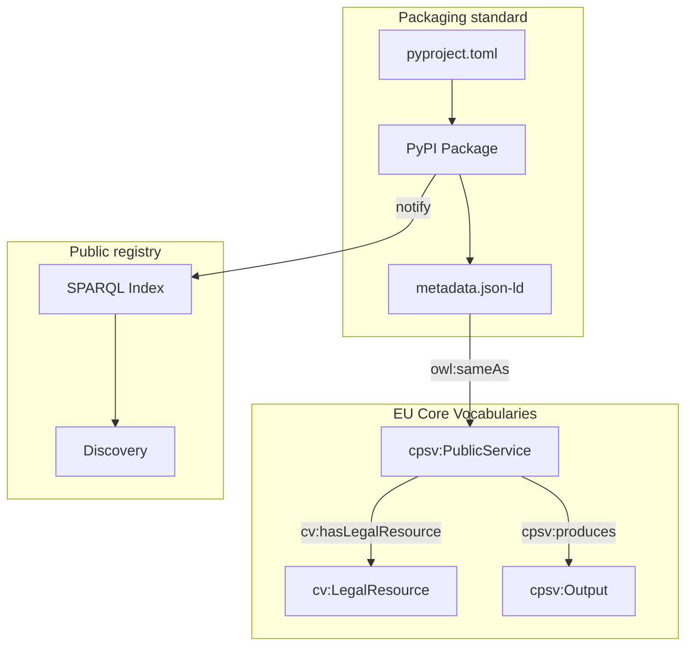

# Registry of Regulatory Algorithms

> **Package, publish and interconnect regulatory algorithms on PyPI — leveraging the EU Core Vocabularies.**

---

## Why this registry?

Regulatory algorithms — eligibility checks, prudential calculations, compliance scoring, normative formulas — are today scattered across application silos, re-implemented identically in every organisation, and impossible to audit transversally.

This packaging standard leverages the **SEMIC Core Vocabularies** to semantically describe regulatory algorithms as `cpsv:PublicService` producers of `cpsv:Output`, governed by `cv:LegalResource`, and provided by `cv:PublicOrganisation`.

The result: Python packages that are both **installable** and **machine-readable**.

| Property | Concrete meaning |
|---|---|
| **Discoverable** | Indexed by regulatory text, domain, `cv:LegalResource` |
| **Interoperable** | Common interface contract (`AlgorithmProtocol`) + JSON-LD metadata |
| **Auditable** | Each result embeds its normative reference (`cv:hasLegalResource`) |
| **EU-aligned** | CPSV-AP namespaces, `owl:sameAs` to EUR-Lex and EU Vocabularies |

---

## Grounded in Core Vocabularies

Each algorithm's metadata is expressed in the **CPSV-AP** (Core Public Service Vocabulary Application Profile):

```turtle
@prefix cpsv: <http://purl.org/vocab/cpsv#> .
@prefix cv:   <http://data.europa.eu/m8g/> .
@prefix dct:  <http://purl.org/dc/terms/> .

<https://registre-algo.gouv.fr/algo/civique/droit-vote/v1>
    a cpsv:PublicService ;
    dct:title               "Right to vote in France — Electoral Code Art. L.2"@en ;
    cv:hasCompetentAuthority <https://registre-algo.gouv.fr/org/mint> ;
    cv:hasLegalResource     <https://www.legifrance.gouv.fr/codes/id/LEGITEXT000006070239/> ;
    cpsv:produces           <https://registre-algo.gouv.fr/output/peut-voter> ;
    owl:sameAs              <https://registre-algo.gouv.fr/pypi/regalgo-civique-droit-vote> .
```

---

## Where to start?

<div class="grid cards" markdown>

- :material-school: **Tutorials**

    Learn by doing. From zero to a published PyPI package in under an hour.

    [→ Start tutorial](tutorials/index.md)

- :material-wrench: **How-to guides**

    Targeted recipes: CI/CD, regulatory versioning, semantic interoperability.

    [→ See guides](how-to-guides/index.md)

- :material-book-open-variant: **Reference**

    Full specifications: JSON-LD metadata schema, interface contract, conventions.

    [→ Browse reference](reference/index.md)

- :material-lightbulb: **Concepts**

    Understand the architecture, design choices, and registry governance.

    [→ Explore concepts](explanation/index.md)

</div>

---

## Quick example

=== "Python"

    ```python
    # pip install regalgo-civique-droit-vote
    from regalgo_civique_droit_vote import DroitVoteAlgorithm, AlgoInput

    algo = DroitVoteAlgorithm()
    result = algo.compute(AlgoInput(data={
        "nationalite_francaise": True,   # French citizen
        "age": 25,                        # Age in years
        "capacite_civique": True,         # Not deprived of civic rights
        "inscrit_listes_electorales": True # Registered on electoral rolls
    }))

    print(result.value)              # True
    print(result.regulation)        # {'text': 'Code électoral', 'article': 'Art. L.2', ...}
    print(result.jsonld_context())  # Full CPSV-AP JSON-LD context
    ```

=== "Catala"

    ```catala
    > Using Electoral_Code_France

    declaration scope RightToVote:
      input french_citizen content boolean
      input age content integer
      input civic_capacity content boolean
      input registered_electoral_rolls content boolean
      output can_vote content boolean

    scope RightToVote:
      # Art. L.2 — nationality, Art. L.3 — minimum age,
      # Art. L.5-L.6 — civic capacity, Art. L.7 — registration
      definition can_vote equals
        french_citizen and
        age >= 18 and
        civic_capacity and
        registered_electoral_rolls
    ```

---

## Architecture at a glance



---

!!! info "Naming convention"
    All registry packages follow the prefix `regalgo-<domain>-<name>`.
    Example: `regalgo-civique-droit-vote`, `regalgo-finance-nsfr`.
    See [naming conventions](reference/naming-conventions.md).

!!! note "Relation with the DINUM common vocabulary"
    This registry is part of the French public administration's semantic web initiative
    led by DINUM. The Core Vocabularies used here are documented on
    [vocabulaire-commun](https://qloridant.github.io/vocabulaire-commun/).
