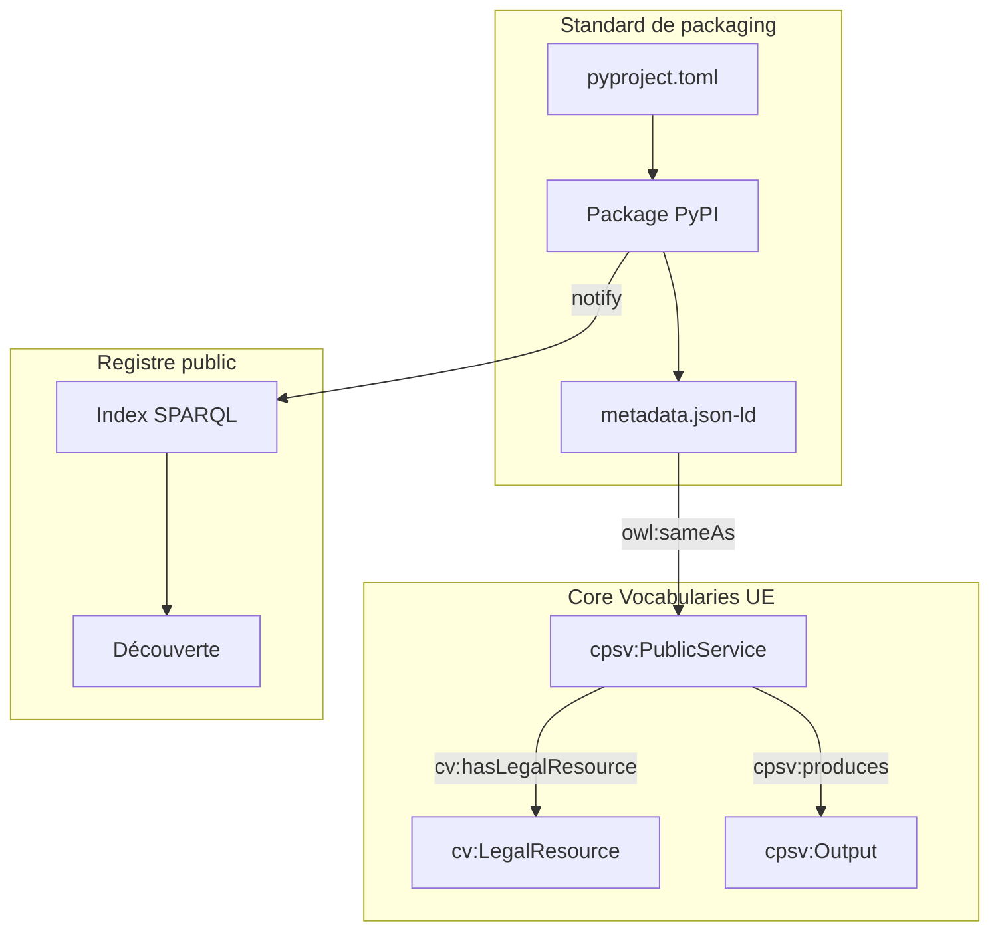

# Registre des Algorithmes Réglementaires

> **Packager, publier et interconnecter des algorithmes réglementaires sur PyPI — en s'appuyant sur les Core Vocabularies de l'Union Européenne.**

---

## Pourquoi ce registre ?

Les algorithmes réglementaires — calculs prudentiels, scoring de conformité, formules normatives — sont aujourd'hui dispersés dans des silos applicatifs, réimplémentés à l'identique dans chaque organisation, et impossibles à auditer de manière transversale.

Ce standard de packaging s'appuie sur les **Core Vocabularies SEMIC** pour décrire sémantiquement les algorithmes réglementaires comme des `cpsv:PublicService` producteurs de `cpsv:Output`, encadrés par des `cv:LegalResource`, et fournis par des `cv:PublicOrganisation`.

Résultat : des packages PyPI qui sont à la fois **installables** et **compréhensibles par les machines**.

| Propriété | Ce que ça signifie concrètement |
|---|---|
| **Découvrables** | Indexés par texte réglementaire, domaine, `cv:LegalResource` |
| **Interopérables** | Contrat d'interface commun (`AlgorithmProtocol`) + métadonnées JSON-LD |
| **Auditables** | Chaque résultat embarque sa référence normative (`cv:hasLegalResource`) |
| **Alignés EU** | Namespaces CPSV-AP, `owl:sameAs` vers EUR-Lex et EU Vocabularies |

---

## Ancrage dans les Core Vocabularies

Les métadonnées de chaque algorithme sont exprimées dans le vocabulaire **CPSV-AP** (Core Public Service Vocabulary Application Profile) :

```turtle
@prefix cpsv: <http://purl.org/vocab/cpsv#> .
@prefix cv:   <http://data.europa.eu/m8g/> .
@prefix dct:  <http://purl.org/dc/terms/> .

<https://registre-algo.gouv.fr/algo/finance/lcr/v1>
    a cpsv:PublicService ;
    dct:title               "Liquidity Coverage Ratio — CRR2 Art. 412"@fr ;
    cv:hasCompetentAuthority <https://data.europa.eu/esco/EBA> ;
    cv:hasLegalResource     <http://data.europa.eu/eli/reg/2013/575/oj> ;
    cpsv:produces           <https://registre-algo.gouv.fr/output/lcr-ratio> ;
    owl:sameAs              <https://registre-algo.gouv.fr/pypi/regalgo-finance-lcr> .
```

---

## Par où commencer ?

<div class="grid cards" markdown>

- :material-school: **Tutoriels**

    Apprenez en faisant. Du zéro au package publié sur PyPI en moins d'une heure.

    [→ Commencer le tutoriel](tutorials/index.md)

- :material-wrench: **Guides pratiques**

    Des recettes ciblées : CI/CD, versioning réglementaire, interopérabilité sémantique.

    [→ Voir les guides](how-to-guides/index.md)

- :material-book-open-variant: **Référence**

    Spécifications complètes : schéma de métadonnées JSON-LD, contrat d'interface, conventions.

    [→ Consulter la référence](reference/index.md)

- :material-lightbulb: **Concepts**

    Comprendre l'architecture, les choix de conception, la gouvernance du registre.

    [→ Explorer les concepts](explanation/index.md)

</div>

---

## Exemple express

```python
# pip install regalgo-finance-lcr
from regalgo_finance_lcr import LCRAlgorithm, AlgoInput

algo = LCRAlgorithm()
result = algo.compute(AlgoInput(data={
    "hqla": 150.0,
    "net_outflows": 100.0
}))

print(result.value)              # 1.5
print(result.regulation)        # {'text': 'CRR2', 'article': 'Art. 412', ...}
print(result.jsonld_context())  # Contexte JSON-LD CPSV-AP complet
```

---

## Architecture en un coup d'œil



---

!!! info "Convention de nommage"
    Tous les packages du registre respectent le préfixe `regalgo-<domaine>-<nom>`.
    Exemple : `regalgo-finance-lcr`, `regalgo-sante-drc`.
    Voir les [conventions de nommage](reference/naming-conventions.md).

!!! note "Relation avec le vocabulaire commun DINUM"
    Ce registre s'inscrit dans la démarche de Web sémantique des administrations françaises
    portée par la DINUM. Les Core Vocabularies utilisés ici sont documentés sur
    [vocabulaire-commun](https://qloridant.github.io/vocabulaire-commun/).
