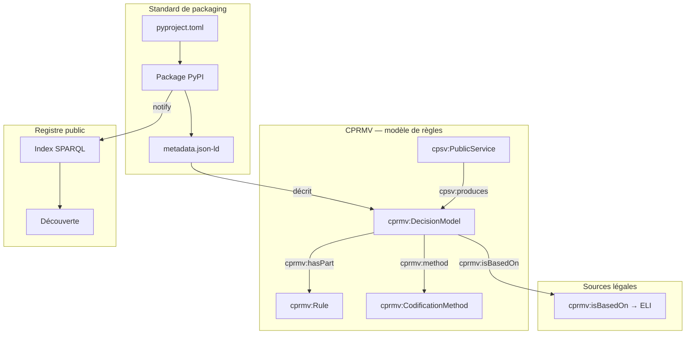

# Registre des Algorithmes Réglementaires

> **Packager, publier et interconnecter des algorithmes réglementaires sur PyPI — en s'appuyant sur CPRMV (Core Public Rule Management Vocabulary) et les Core Vocabularies de l'Union Européenne.**

---

## Pourquoi ce registre ?

Les algorithmes réglementaires — éligibilité à un droit, scoring de conformité, formules normatives — sont aujourd'hui dispersés dans des silos applicatifs, réimplémentés à l'identique dans chaque organisation, et impossibles à auditer de manière transversale.

Ce standard de packaging s'appuie sur le **[CPRMV 0.4.0](https://standaarden.open-regels.nl/standards/cprmv/0.4.0/)** (Core Public Rule Management Vocabulary) pour décrire sémantiquement les algorithmes réglementaires comme des `cprmv:DecisionModel` — des ensembles de règles formalisées (`cprmv:RuleSet`) produits par un `cpsv:PublicService`, tracés jusqu'à leur source normative via `cprmv:isBasedOn`.

Résultat : des packages standardisés qui sont à la fois **installables** et **compréhensibles par les humains et les machines**.

| Propriété | Ce que ça signifie concrètement |
|---|---|
| **Découvrables** | Indexés par texte réglementaire, domaine, `cprmv:isBasedOn` |
| **Interopérables** | Contrat d'interface commun (`AlgorithmProtocol`) + métadonnées JSON-LD |
| **Auditables** | Chaque règle cite sa source (`cprmv:sourceQuote`) et sa méthode (`cprmv:method`) |
| **Alignés EU** | CPRMV étend CPSV-AP ; namespaces compatibles EUR-Lex et EU Vocabularies |

---

## Ancrage dans CPRMV

Les métadonnées de chaque algorithme sont exprimées en **CPRMV** (Core Public Rule Management Vocabulary), un standard qui étend CPSV-AP pour la gestion formelle des règles publiques. Un algorithme réglementaire y est un `cprmv:DecisionModel` — un ensemble de règles formalisées (`cprmv:RuleSet`) produit par un service public et traçable jusqu'à ses sources légales :

```turtle
@prefix cpsv:  <http://purl.org/vocab/cpsv#> .
@prefix cprmv: <https://standaarden.open-regels.nl/standards/cprmv/0.4.0/> .
@prefix cv:    <http://data.europa.eu/m8g/> .
@prefix dct:   <http://purl.org/dc/terms/> .
@prefix xsd:   <http://www.w3.org/2001/XMLSchema#> .

# Le service public encadrant l'algorithme
<https://regles.gouv.fr/service/civique/droit-vote>
    a cpsv:PublicService ;
    dct:title                "Vérification du droit de vote"@fr ;
    cv:hasCompetentAuthority <https://regles.gouv.fr/org/mint> ;
    cpsv:produces            <https://regles.gouv.fr/algo/civique/droit-vote/v1> .

# Le modèle de décision CPRMV (l'algorithme lui-même)
<https://regles.gouv.fr/algo/civique/droit-vote/v1>
    a cprmv:DecisionModel ;
    dct:title          "Droit de vote en France — Code électoral Art. L.2"@fr ;
    cprmv:isBasedOn    <https://www.legifrance.gouv.fr/codes/id/LEGITEXT000006070239/> ;
    cprmv:method       cprmv:FormalisationMethod, cprmv:CodificationMethod ;
    cprmv:validFrom    "2024-01-01"^^xsd:date ;
    cprmv:hasPart      <https://regles.gouv.fr/rule/civique/droit-vote/nationalite> ,
                       <https://regles.gouv.fr/rule/civique/droit-vote/majorite> ,
                       <https://regles.gouv.fr/rule/civique/droit-vote/capacite-civique> ,
                       <https://regles.gouv.fr/rule/civique/droit-vote/inscription> .
```

---

## Par où commencer ?

<div class="grid cards" markdown>

- :material-school: **Tutoriels**

    Apprenez en faisant. Du zéro au package publié sur PyPI en moins d'une heure.

    [→ Commencer le tutoriel](tutorials/index.md)

- :material-wrench: **Guides pratiques**

    Des recettes ciblées : CI/CD, versioning réglementaire, interopérabilité sémantique.

    [→ Voir les guides](how-to-guides/index.md)

- :material-book-open-variant: **Référence**

    Spécifications complètes : schéma de métadonnées JSON-LD, contrat d'interface, conventions.

    [→ Consulter la référence](reference/index.md)

- :material-lightbulb: **Concepts**

    Comprendre l'architecture, les choix de conception, la gouvernance du registre.

    [→ Explorer les concepts](explanation/index.md)

</div>

---

## Exemple express

=== "Python"

    ```python
    # pip install regalgo-civique-droit-vote
    from regalgo_civique_droit_vote import DroitVoteAlgorithm, AlgoInput

    algo = DroitVoteAlgorithm()
    result = algo.compute(AlgoInput(data={
        "nationalite_francaise": True,
        "age": 25,
        "capacite_civique": True,
        "inscrit_listes_electorales": True
    }))

    print(result.value)              # True
    print(result.regulation)        # {'dct:title': 'Code électoral', 'dct:coverage': 'Art. L.2, L.5, L.6, L.7', ...}
    print(result.jsonld_context())  # Contexte JSON-LD CPSV-AP complet
    ```

=== "Catala"

    ```catala
    > Utilisation Code_Electoral_Français

    déclaration champ d'application DroitDeVote:
      entrée nationalite_francaise contenu booléen
      entrée age contenu entier
      entrée capacite_civique contenu booléen
      entrée inscrit_listes_electorales contenu booléen
      résultat peut_voter contenu booléen

    champ d'application DroitDeVote:
      # Art. L.2 — nationalité, Art. L.3 — majorité,
      # Art. L.5-L.6 — capacité civique, Art. L.7 — inscription
      définition peut_voter égal à
        nationalite_francaise et
        age >= 18 et
        capacite_civique et
        inscrit_listes_electorales
    ```

---

## Architecture en un coup d'œil


```mermaid
graph TB
    subgraph "Standard de packaging"
        A[pyproject.toml] --> B[Package PyPI]
        B --> C[metadata.json-ld]
    end
    subgraph "CPRMV — modèle de règles"
        D[cpsv:PublicService]
        DM[cprmv:DecisionModel]
        R[cprmv:Rule]
        M[cprmv:CodificationMethod]
    end
    subgraph "Sources légales"
        E[cprmv:isBasedOn → ELI]
    end
    subgraph "Registre public"
        G[Index SPARQL]
        H[Découverte]
    end
    C -->|décrit| DM
    D -->|cpsv:produces| DM
    DM -->|cprmv:hasPart| R
    DM -->|cprmv:method| M
    DM -->|cprmv:isBasedOn| E
    B -->|notify| G
    G --> H
```

---

!!! info "Convention de nommage"
    Tous les packages du registre respectent le préfixe `regalgo-<domaine>-<nom>`.
    Exemple : `regalgo-civique-droit-vote`, `regalgo-finance-nsfr`.
    Voir les [conventions de nommage](reference/naming-conventions.md).

!!! note "Relation avec CPRMV et le vocabulaire commun DINUM"
    Ce registre s'appuie sur [CPRMV 0.4.0](https://standaarden.open-regels.nl/standards/cprmv/0.4.0/),
    un standard néerlandais (open-regels.nl) qui étend CPSV-AP pour la gestion formelle des règles publiques.
    Les Core Vocabularies sous-jacents sont documentés sur
    [vocabulaire-commun](https://qloridant.github.io/vocabulaire-commun/).
