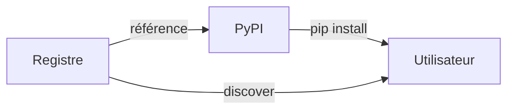

# Tutoriel 03 — Intégrer au registre public

**Durée estimée :** ~20 minutes  
**Prérequis :** [Tutoriel 02](02-publish-pypi.md) complété, package publié sur PyPI.

---

## Qu'est-ce que l'intégration au registre ?

Publier sur PyPI rend votre package *installable*. L'intégration au registre le rend *découvrable* : il apparaît dans l'index public, est interrogeable par domaine/texte réglementaire, et peut être composé avec d'autres algorithmes.



---

## 1. Vérifier les prérequis d'entrée au registre

Votre package doit satisfaire la **checklist de conformité** :

```bash
pip install regalgo-validator
regalgo-validator check regalgo-civique-droit-vote
```

```
✅ Nommage conforme  (regalgo-<domaine>-<nom>)
✅ metadata.json présent et valide
✅ AlgorithmProtocol implémenté
✅ Version sémantique valide
✅ Licence déclarée
⚠️  Champ regulation.authority manquant  → optionnel, recommandé
```

!!! info "Validator"
    `regalgo-validator` est lui-même un package du registre.
    Il vérifie le schéma `metadata.json` et l'implémentation du protocole.

---

## 2. Forker et soumettre une Pull Request

Le registre est géré comme un **fichier d'index versionné** dans le dépôt public.

```bash
# 1. Forker le dépôt du registre
gh repo fork your-org/algo-registry --clone

# 2. Créer une branche
cd algo-registry
git checkout -b add/civique-droit-vote

# 3. Ajouter votre entrée dans l'index
cat >> registry/index.yaml << 'EOF'
- algo_id: civique.droit-vote.v1
  pypi_package: regalgo-civique-droit-vote
  latest_version: "1.0.0"
  domain: civique
  regulation:
    text: Code électoral
    article: "Art. L.2, L.5, L.6, L.7"
    authority: Ministère de l'Intérieur
  maintainer: your-org
  status: stable
EOF

# 4. Valider localement
regalgo-validator check-registry registry/index.yaml

# 5. Ouvrir la PR
git commit -am "feat(registry): add civique.droit-vote.v1"
git push origin add/civique-droit-vote
gh pr create --title "Add: civique.droit-vote.v1 (Droit de vote France)" \
             --body "Adds droit de vote algorithm per Code électoral Art. L.2. Package: regalgo-civique-droit-vote 1.0.0"
```

---

## 3. Processus de revue

| Étape | Responsable | Délai typique |
|---|---|---|
| Vérification automatique (CI) | GitHub Actions | < 5 min |
| Revue technique | Mainteneurs du registre | < 3 jours ouvrés |
| Revue réglementaire (optionnelle) | Expert domaine | Variable |
| Merge et déploiement | Mainteneurs | Immédiat après approbation |

---

## 4. Après le merge

Votre algorithme est référencé et découvrable :

```bash
# Recherche dans le registre
regalgo search --domain civique --regulation "Code électoral"

# Résultat
# civique.droit-vote.v1  |  regalgo-civique-droit-vote  |  1.0.0  |  stable
```

Et composable avec d'autres algorithmes du registre :

```python
from regalgo_civique_droit_vote import DroitVoteAlgorithm, AlgoInput
from regalgo_civique_eligibilite_liste import EligibiliteListeAlgorithm  # autre package

vote = DroitVoteAlgorithm()
liste = EligibiliteListeAlgorithm()

# Les deux respectent AlgorithmProtocol — même interface
for algo in [vote, liste]:
    result = algo.compute(AlgoInput(data=my_data))
    print(f"{algo.algo_id}: {result.value}")
```

---

## ✅ Résultat

Votre algorithme réglementaire est désormais :

- **Publié** sur PyPI et installable via `pip`
- **Indexé** dans le registre public et découvrable
- **Interopérable** via `AlgorithmProtocol`
- **Traçable** : chaque calcul embarque sa référence normative

---

## La suite

| Je veux… | Aller à… |
|---|---|
| Automatiser la publication | [Guide CI/CD](../how-to-guides/cicd.md) |
| Chaîner plusieurs algorithmes | [Guide interopérabilité](../how-to-guides/interoperability.md) |
| Gérer les versions réglementaires | [Guide versioning](../how-to-guides/versioning.md) |
