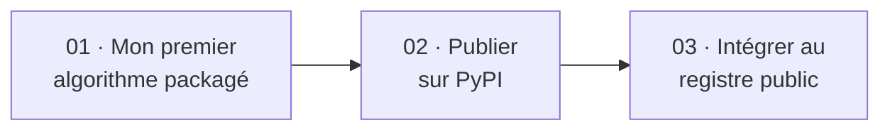

# Tutoriels

Les tutoriels sont des **apprentissages guidés**. Ils vous accompagnent pas à pas, de zéro à un résultat concret. Vous n'avez pas besoin de comprendre chaque détail pour suivre — la compréhension viendra après.

---

## Parcours recommandé

| # | Tutoriel | Durée | Prérequis |
|---|---|---|---|
| 01 | [Mon premier algorithme packagé](01-first-package.md) | ~20 min | Python 3.10+, pip |
| 02 | [Publier sur PyPI](02-publish-pypi.md) | ~15 min | Tutoriel 01, compte TestPyPI |
| 03 | [Intégrer au registre public](03-register-algo.md) | ~20 min | Tutoriel 02 |

---

!!! tip "Première fois ?"
    Commencez par le [tutoriel 01](01-first-package.md). Il n'assume aucune connaissance du registre.
